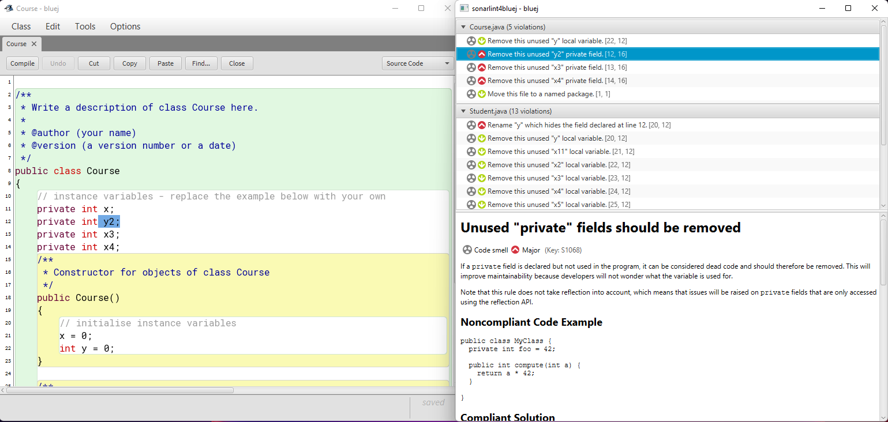
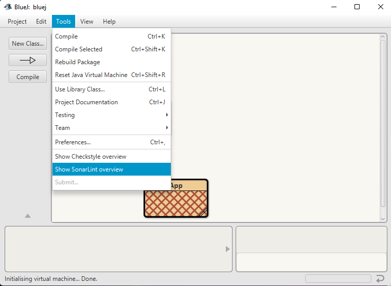
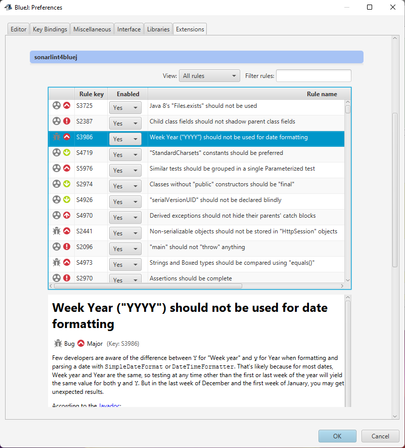

# BlueJ-SonarLint-Plugin

sonarlint4bluej is a BlueJ plugin that introduces the SonarLint code analysis tool to BlueJ. (Java only)
The plugin provides clear feedback with remediation guidance on flaws such as code smells, bugs and security vulnerabilities. 

## Installing the extension

1. Download the latest version of the extension found [here][1]
2. Move the downloaded JAR to a BlueJ extensions2 directory
3. Start BlueJ

  **BlueJ Extensions can be installed in three different directories:**
  - `User directory` installs for this user
  - `System directory` installs for all users of this system
  - `Project directory` installs for this project only
  
To install for a project, make a directory called `extensions2` in the projects root directory and move the JAR to that directory.

**In order to install for a user/system place the JAR in one of these directories:**

| Operating System | Install-type | Directories                                                  |
|------------------|--------------|--------------------------------------------------------------|
| **Mac**          | *User*       | `$HOME/Library/Preferences/org.bluej/extensions2`            |
|                  | *System*     | `<BLUEJ_HOME>/BlueJ.app/Contents/Java/extensions2`           |
| **Unix**         | *User*       | `$HOME/.bluej/extensions2`                                   | 
|                  | *System*     | `<BLUEJ_HOME>/lib/extensions2`                               |
| **Windows**      | *User*       | `%USERNAME%\bluej\extensions2`                               | 
|                  | *System*     | `%PROGRAMFILES%\BlueJ\lib\extensions2`                       |

**Tip:** For Mac users, Control-click BlueJ.app and choose Show Package Contents to find the system directory.

For further information about Extensions in BlueJ see: [BlueJ Extensions][2]

## Usage 

The SonarLint Plugin runs checks in BlueJ when a Project/Package is opened and when a class file's state changes.

You can view the violations discovered by choosing `Show SonarLint overview` from the `Tools` menu.

Rules can be excluded from Code Analysis by disabling them through the BlueJ preferences.

You can find the preferences by choosing `Preferences...` from the `Tools` menu and navigating to the `Extensions` tab.

## Issues

Are you experiencing bugs/problems using this plugin? 

Submit a [bug report][3] with detailed reproduction steps.

We also appreciate ideas of enhancements and new features, feel free to suggest new features [here][4].

## Contributing
Contributions are welcome. Feel free to discuss the changes with us in a [feature request][4] before submitting a Pull Request.

The architecture of the extension, with class and sequence diagrams, is described in [docs/ARCHITECTURE.md](docs/ARCHITECTURE.md).

## Dependencies

This plugin relies on the usage of the BlueJ Extensions2 API. Since BlueJ 6 the API is part of `bluej.jar`, and the version used is added to this repository in the `lib` directory.
The jar is bundled with the BlueJ installation, it can be retrieved from there. Detailed instructions can be found in the [BlueJ documentation][5].

Toolscripts are available to install a new version of the jar to the `lib` directory: [updateBlueJdeps.ps1](tools/updateBlueJdeps.ps1) for Windows and [updateBlueJdeps.sh](tools/updateBlueJdeps.sh) for macOS.

The plugin is built against BlueJ 6.0.0 (Extensions API 3.4), which runs on Java 21, and requires a JDK 21 to build.

**Note:** the Windows script assumes BlueJ is installed for all users.

A lot of core functionality for this plugin is provided by [BlueJ-Linting-Core][6], feel free to take a look at it as well.

[1]: https://github.com/NTNU-IE-IIR/BlueJ-SonarLint-Plugin/releases/latest
[2]: https://www.bluej.org/extensions/extensions2.html
[3]: https://github.com/NTNU-IE-IIR/BlueJ-SonarLint-Plugin/issues/new?assignees=&labels=&template=bug_report.md&title=
[4]: https://github.com/NTNU-IE-IIR/BlueJ-SonarLint-Plugin/issues/new?assignees=&labels=&template=feature_request.md&title=
[5]: https://www.bluej.org/extensions/writingextensions2.html
[6]: https://github.com/NTNU-IE-IIR/BlueJ-Linting-Core/