# Architecture of SonarLint for BlueJ

This document describes how the SonarLint extension for BlueJ (`sonarlint4bluej`) is built:
the main building blocks, how they relate, and what happens at run time when BlueJ starts the
extension, when a project is opened, when a class is compiled and when rules are configured.

It describes the extension as of version 1.1.0 (BlueJ 6, Java 21, sonarlint-core 11.10).

## Contents

1. [Overview](#1-overview)
2. [Building blocks](#2-building-blocks)
3. [Class loading and packaging](#3-class-loading-and-packaging)
4. [Class diagrams](#4-class-diagrams)
5. [Sequence diagrams](#5-sequence-diagrams)
6. [The SonarLint backend](#6-the-sonarlint-backend)
7. [Design decisions and pitfalls](#7-design-decisions-and-pitfalls)

## 1. Overview

The extension analyzes the Java classes of the projects open in BlueJ with
[SonarLint](https://github.com/SonarSource/sonarlint-core) and its Java analyzer
([sonar-java](https://github.com/SonarSource/sonar-java)). It shows the issues found in an
overview window per project, and lets the user turn individual rules on and off in BlueJ's
preferences.

The extension consists of three parts:

| Part | Where | Responsibility |
|---|---|---|
| **This extension** | `no.ntnu.iir.bluej.extensions.linting.sonarlint` | Connects BlueJ, Linting-Core and SonarLint: runs the analyses, converts SonarLint issues to violations and provides the rule preferences. |
| **BlueJ-Linting-Core** | [`bluej-linting-core`](https://github.com/NTNU-IE-IIR/BlueJ-Linting-Core) (Maven dependency) | Linter-independent parts shared with the Checkstyle extension: listens to BlueJ's package and class events, keeps track of violations and shows them in the overview window. |
| **SonarLint backend** | `sonarlint-rpc-impl` and `sonarlint-rpc-java-client` (Maven dependencies) and the bundled `sonar-java-plugin.jar` | Runs the actual analysis. Run in-process, and driven through its JSON-RPC API. |

BlueJ itself provides the extension API (`bluej.extensions2`, in `bluej.jar`) and JavaFX, which
the user interface is built with.

## 2. Building blocks

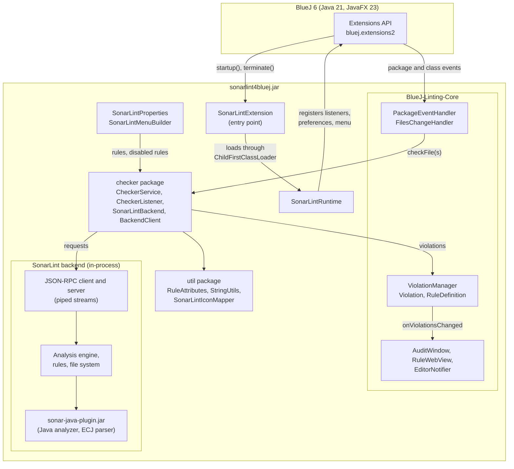

The extension code is organized in these packages (all under
`no.ntnu.iir.bluej.extensions.linting.sonarlint`):

| Package | Classes | Responsibility |
|---|---|---|
| *(root)* | `SonarLintExtension`, `ChildFirstClassLoader` | Entry point loaded by BlueJ, and the class loader that isolates the rest of the extension from BlueJ's libraries. |
| *(root)* | `SonarLintRuntime` | Starts the extension and registers it with BlueJ. |
| *(root)* | `SonarLintProperties`, `SonarLintRuleDetails`, `FilterType` | The SonarLint tab in BlueJ's preferences: the rule table, filtering, and enabling/disabling rules. |
| *(root)* | `SonarLintMenuBuilder` | The *Tools → Show SonarLint overview* menu item. |
| `checker` | `CheckerService` | Implements Linting-Core's `ICheckerService`: runs analyses and holds the rules. |
| `checker` | `CheckerListener` | Converts the issues SonarLint reports into Linting-Core `Violation`s. |
| `checker` | `SonarLintBackend` | Starts, configures and talks to the SonarLint backend. |
| `checker` | `BackendClient` | The client side of the backend connection: answers the backend's callbacks. |
| `util` | `RuleAttributes` | Derives the legacy rule type and severity from a rule's software impacts. |
| `util` | `StringUtils` | Formats rule names and descriptions as text and HTML. |
| `util` | `SonarLintIconMapper` | Maps rule types and severities to icons. |

## 3. Class loading and packaging

### Packaging

The extension is distributed as a single "uber jar", built by the Maven Shade plugin. It
contains the extension, Linting-Core, the SonarLint backend with all its dependencies
(Spring, H2, Xodus, JGit, logback, ...) and, as a resource, the Java analyzer
`plugins/sonar-java-plugin.jar`. BlueJ and JavaFX are left out, as BlueJ provides them. The
jar is installed in BlueJ's `extensions2` folder.

### Class loading

BlueJ loads each extension with a *parent-first* class loader: a class is looked up in BlueJ's
own libraries first, and only then in the extension jar. BlueJ ships older versions of several
libraries the SonarLint backend uses (slf4j 1.7, Guava, JGit, commons-codec). Loaded
parent-first, the backend would get BlueJ's versions, and fails to start (slf4j 1.7 has no
binding to logback, and returns a no-op logger the backend can not use).

The extension is therefore loaded in two steps:

1. BlueJ loads `SonarLintExtension`, a thin entry point that only depends on BlueJ and the JDK.
2. `SonarLintExtension` creates a `ChildFirstClassLoader` over its own jar, and loads
   `SonarLintRuntime` through it, using reflection. Everything `SonarLintRuntime` uses, the
   SonarLint backend included, is then loaded from the extension jar first. Only the JDK
   (`java.*`, `javax.*`, `jdk.*`, ...), BlueJ (`bluej.*`) and JavaFX (`javafx.*`) are shared with
   BlueJ, as the extension talks to BlueJ through them.

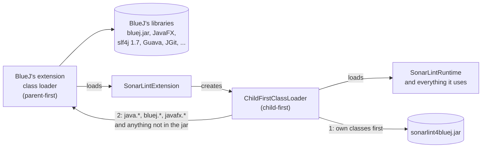

## 4. Class diagrams

The class diagrams show the most important fields and methods only. Classes from BlueJ,
Linting-Core and SonarLint are shown with a namespace prefix.

### 4.1 Startup and integration with BlueJ

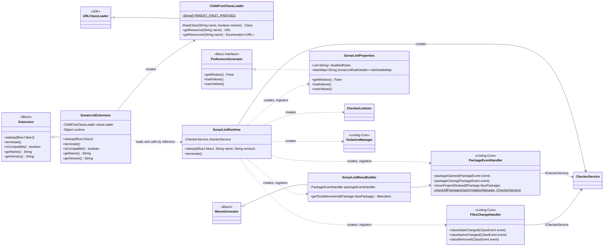

`SonarLintExtension` holds the runtime as a plain `Object`, and calls `startup` and `terminate`
by reflection. Referring to `SonarLintRuntime` directly would make BlueJ's class loader load it,
and with it the rest of the extension, defeating the `ChildFirstClassLoader`.

### 4.2 Checking files

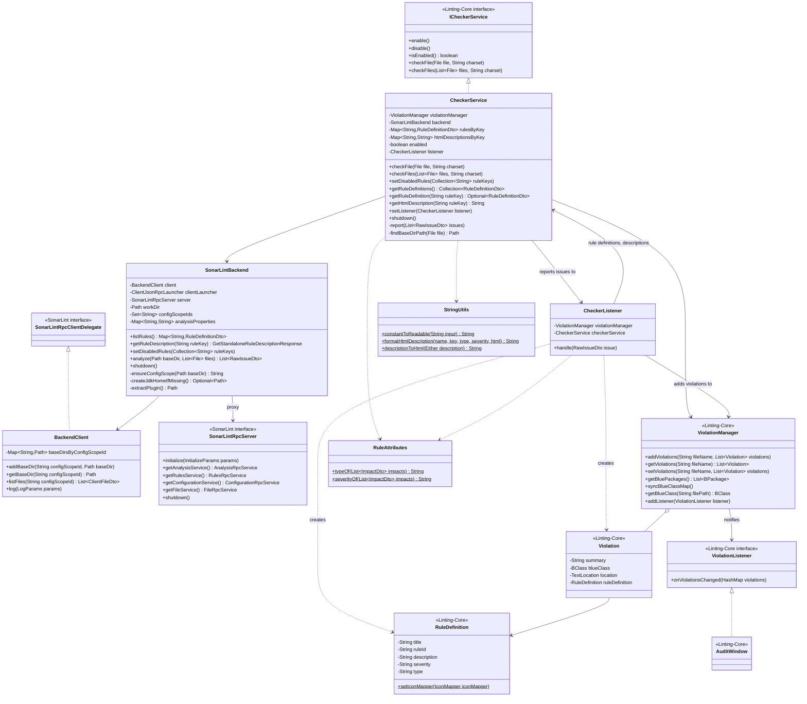

### 4.3 Rules and preferences

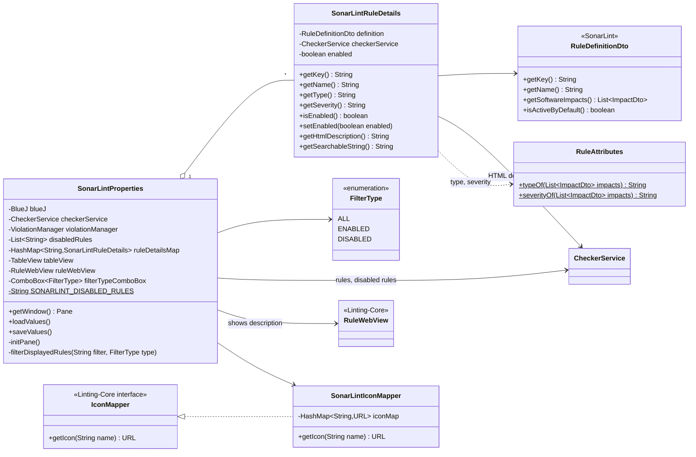

The disabled rules are stored as a comma-separated list of rule keys (for example
`java:S106,java:S1220`) in BlueJ's extension property `SonarLint.DisabledRules`.

## 5. Sequence diagrams

### 5.1 Starting the extension

BlueJ calls `startup` when it starts. Starting the SonarLint backend loads the Java analyzer,
which takes a few seconds.

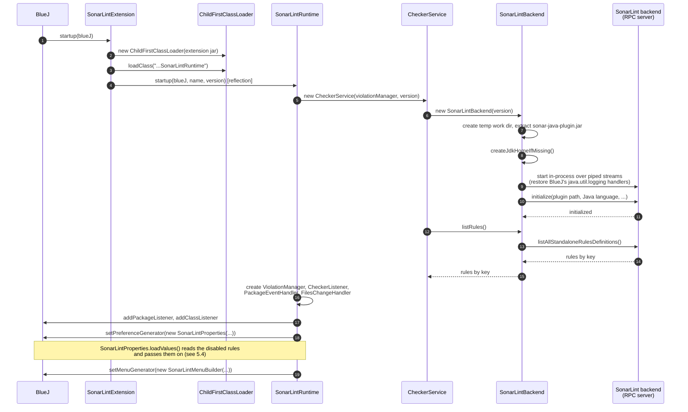

### 5.2 Opening a project

When a project is opened, Linting-Core creates the overview window for it, and checks all
compiled classes of its packages.

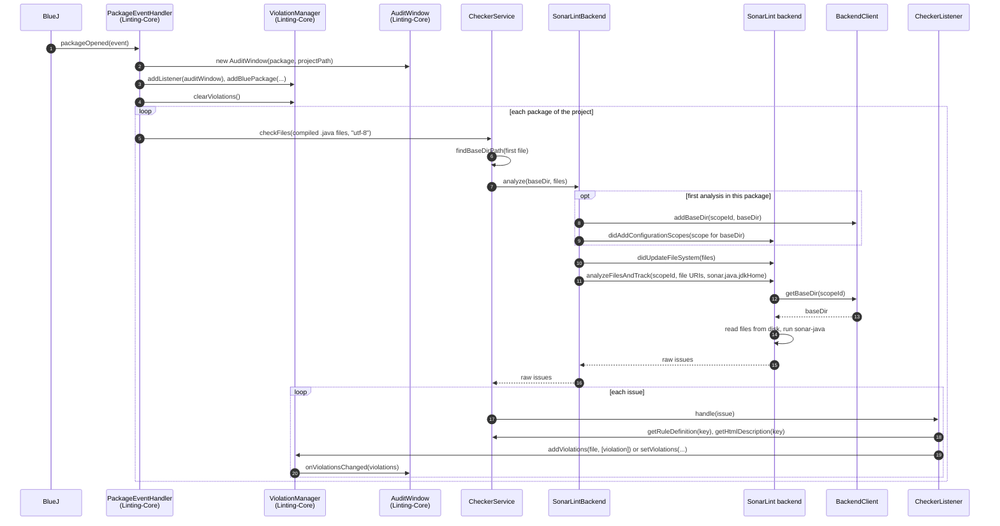

`analyze` blocks until the backend has returned the issues, so the check is synchronous, as
Linting-Core expects. The backend reads the file contents from disk. BlueJ saves a class before
it compiles it, so the analysis sees the compiled version.

### 5.3 Compiling a class

When a class changes state (for example after being compiled), Linting-Core checks that file
again. As SonarLint only reports the issues it finds, the violations of the file are cleared
first.

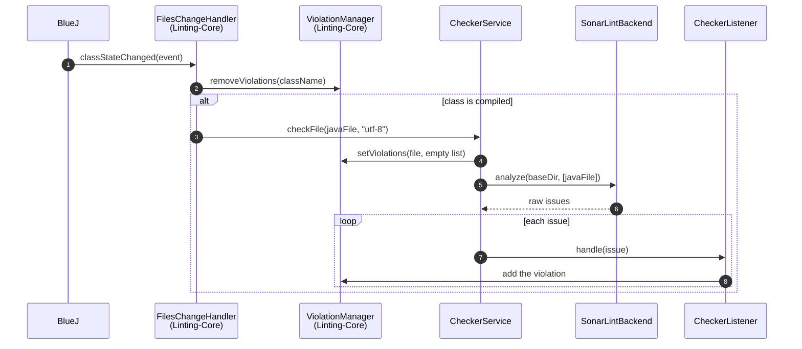

### 5.4 Configuring rules

The rule table is filled from the rules the backend lists. When a rule is disabled, its key is
added to the disabled rules. When the preferences are saved, the disabled rules are stored in
BlueJ's extension properties. When they are loaded, they are passed on to the backend, which
then excludes those rules from all further analyses.

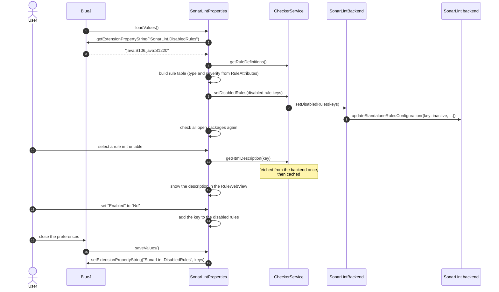

### 5.5 Stopping the extension

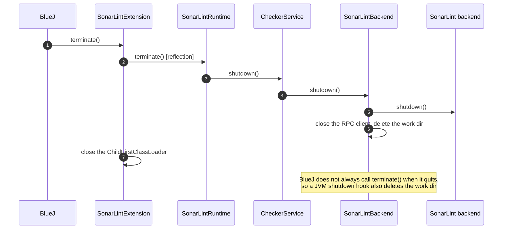

## 6. The SonarLint backend

### In-process JSON-RPC

Since version 10, sonarlint-core no longer offers a Java API for running analyses. It is a
*backend* that IDE plugins talk to through a JSON-RPC protocol. `SonarLintBackend` runs the
backend in the same JVM as BlueJ, connected to its client through two pairs of piped streams:

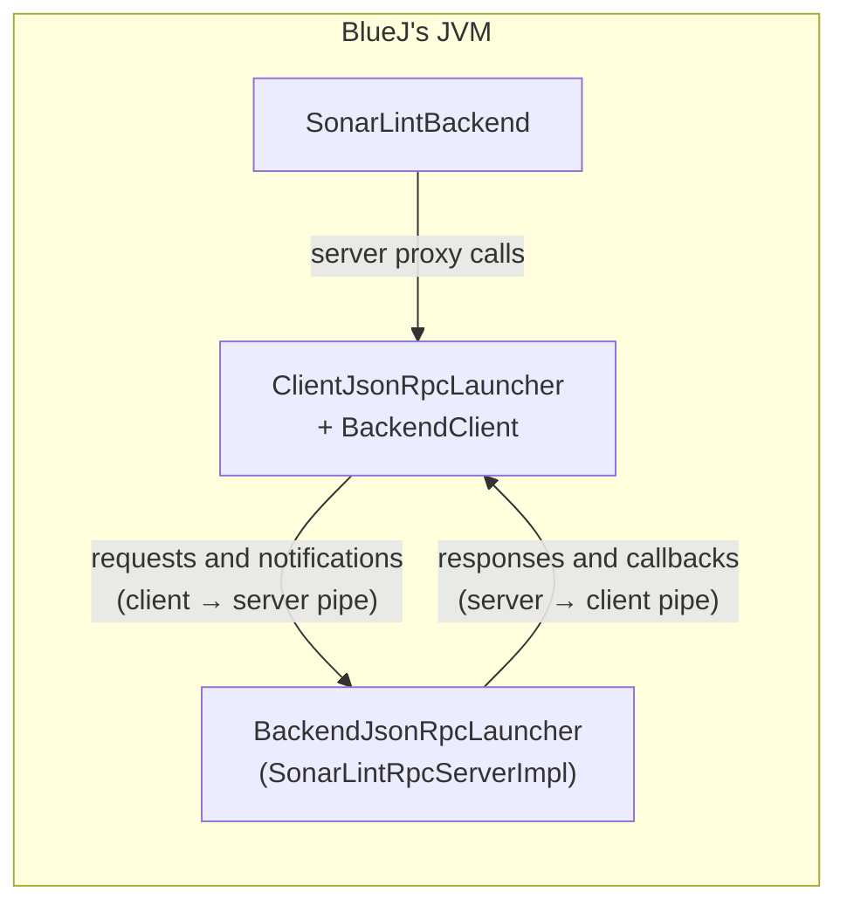

`SonarLintBackend` wraps the calls the extension needs:

| Method | RPC call(s) |
|---|---|
| constructor | `initialize` |
| `listRules()` | `rules/listAllStandaloneRulesDefinitions` |
| `getRuleDescription(key)` | `rules/getStandaloneRuleDetails` |
| `setDisabledRules(keys)` | `rules/updateStandaloneRulesConfiguration` |
| `analyze(baseDir, files)` | `configuration/didAddConfigurationScopes` (first time per directory), `file/didUpdateFileSystem`, `analysis/analyzeFilesAndTrack` |
| `shutdown()` | `shutdown` |

The backend calls back to the client for information it needs; `BackendClient` answers them.
Only standalone analysis is supported (no connection to SonarQube Server or Cloud), so most of
these callbacks are no-ops.

### Configuration scopes and files

The backend organizes files in *configuration scopes*, in an IDE usually one per project. The
extension uses one scope per BlueJ package directory, identified by the absolute path of the
directory. Files are not listed up front: before each analysis, the files to analyze are
announced with `didUpdateFileSystem`, so files created after the scope was added are known too.

### Rules, types and severities

In sonarlint-core 11, rules are described by their *software impacts* (a software quality and an
impact severity), following SonarQube's Clean Code taxonomy, rather than by the legacy *type*
and *severity* the extension shows. `RuleAttributes` derives the legacy values from the most
severe impact, using the same mapping as SonarQube:

| Software quality | Type | | Impact severity | Severity |
|---|---|---|---|---|
| RELIABILITY | BUG | | BLOCKER | BLOCKER |
| SECURITY | VULNERABILITY | | HIGH | CRITICAL |
| MAINTAINABILITY | CODE_SMELL | | MEDIUM | MAJOR |
| | | | LOW | MINOR |
| | | | INFO | INFO |

Issues found in an analysis still carry a legacy type and severity themselves, which are used
when present.

Rules are configured as "excluded rules": every rule the user has not disabled uses its default
activation. Security hotspots are not reported, as they are code for a human to review rather
than issues.

### The JDK used for analysis

The Java analyzer parses files with the Eclipse Java compiler (ECJ), which reads the JDK version
from the `release` file in the JDK home. The Java runtime bundled with BlueJ (on macOS) has no
such file, and ECJ then fails to parse any file. When the running runtime has no `release`
file, `SonarLintBackend` puts a JDK home together in its work directory (a `release` file and
links to the runtime's `lib/modules` and `lib/jrt-fs.jar`), and passes it to the analyzer as
`sonar.java.jdkHome`.

### Work directory

The backend's storage and work directories, the extracted `sonar-java-plugin.jar` and the
synthetic JDK home are kept in a temporary directory (`sonarlint4bluej*` in the system's temp
directory), which is deleted when the extension stops or the JVM exits.

## 7. Design decisions and pitfalls

- **Run the backend in-process.** SonarLint's IDE plugins can also run the backend as a separate
  process. In-process keeps installation to a single jar and avoids managing a second JVM, at
  the cost of a large jar (about 70 MB) and the class loading isolation described in
  [section 3](#3-class-loading-and-packaging).
- **Do not relocate (shade) slf4j.** Relocating BlueJ's conflicting libraries would be an
  alternative to the `ChildFirstClassLoader`, but the backend exposes `org/slf4j` to analyzer
  plugins by name, and sonar-java uses it. The child-first class loader solves the conflicts
  without renaming anything.
- **Restore BlueJ's logging.** On startup, the backend replaces the handlers of the
  `java.util.logging` root logger with a bridge to its own logging. That would redirect all of
  BlueJ's logging, so `SonarLintBackend` restores BlueJ's handlers after starting the backend.
- **Log to standard error.** `BackendClient` prints the backend's warnings and errors to
  standard error, which BlueJ writes to its debug log (`bluej-debuglog.txt`);
  `java.util.logging` output does not end up there.
- **Use `Path.of(URI)` for file URIs.** On Windows, the URI of a file on a network share
  (`\\server\share\X.java`) is `file://server/share/X.java`, which `new File(URI)` rejects.
- **Check synchronously.** Linting-Core expects `checkFile` and `checkFiles` to report all
  violations before returning, so `SonarLintBackend.analyze` waits for the analysis result
  (with a timeout) instead of using the backend's asynchronous issue streaming.
- **Version constraints.** The extension requires BlueJ 6 (Java 21). JavaFX is kept at the
  version BlueJ bundles (23.0.2). sonarlint-core is at 11.10, as the 12.0 release on Maven
  Central is missing modules it depends on.
